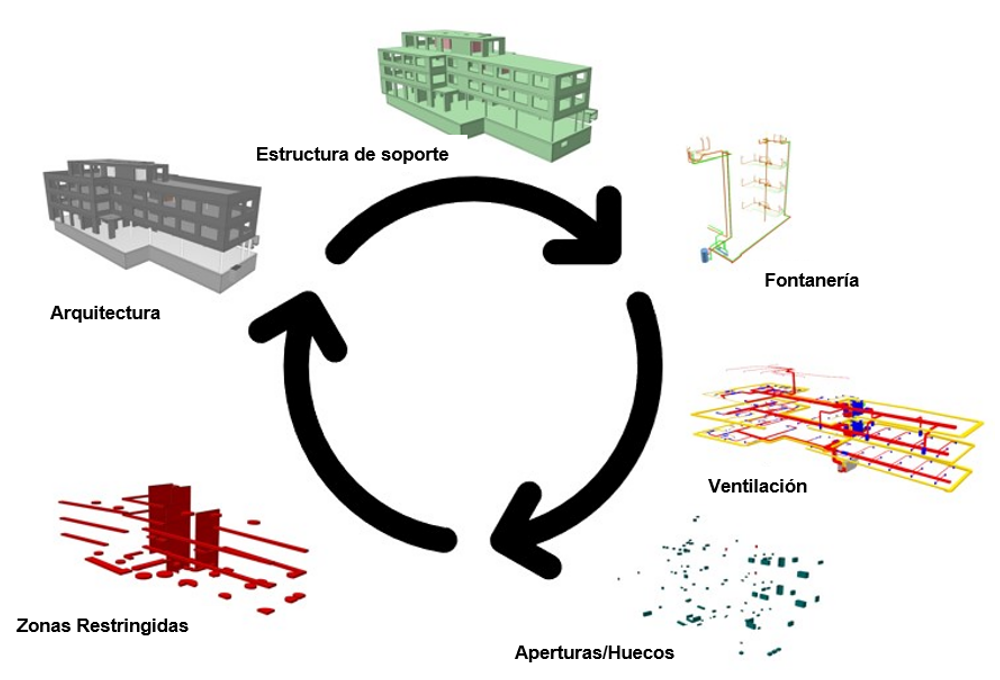

# Requisitos de Intercambio

## Qué? Por qué? Quién? Cómo? Cuándo?

Qué datos necesitas de quién para su planificación?  
Determina lo que necesita de cada parte involucrada en el proyecto.

Cómo deben describirse estos datos?  
A qué calidad debe corresponder la geometría?  
Qué información se necesita de la contraparte?  
Qué definición de vista de modelo se utiliza para la aplicación?  
Para el intercambio de datos, recomendamos la MVD CoordinationView para IFC 2x3.  
Para IFC 4, se recomienda el MVD DesignTransferView.  

Un MVD (Model View Definition) define un subconjunto de la especificación IFC (esquema IFC). Este subconjunto se centra en los requisitos (requisitos de intercambio) del creador y del receptor de la información. Los requisitos se obtienen a partir de un IDM (Information Delivery Manual)[^1].
[^1]: [BIMcert Handbuch](https://bif.bauwesen.tuwien.ac.at/fortbildung/kurse/aktuelle-kurse/bimcert/)

Un IDM define el alcance y el tipo de requisito de información que deben necesitar o entregar los participantes en el proyecto en un momento determinado (proceso) (requisitos de intercambio).

Con una definición exacta de los requisitos de intercambio en el equipo de proyecto, los modelos pueden intercambiarse de forma eficiente e integrarse en el proceso de planificación.

Los contenidos respectivos se dividen en modelos temáticos (derivados del modelo de referencia). Compruebe el contenido de los modelos (geometría, información). Al principio del proyecto, se debe definir un punto cero, la estructura de las plantas, así como el procedimiento de planificación (procesos).

[Checklist Modelling](../2.Modellierung/modelling.es.md#ifc-model-setup--cadwork-export) :bulb:

## Tipos de IFC relevantes para la construcción en madera

Tabla de ejemplo - el alcance de los datos depende del proyecyo

| Entities                      | recommended | not recommended | comment                                                                                                                     |
| ----------------------------- | :---------: | :-------------: | --------------------------------------------------------------------------------------------------------------------------- |
| IfcBeam                       |     :x:     |
| IfcBuildingElementProxy       |     :x:     |       :x:       | situational   For the exchange of recesses, BuildingElementProxy's with the ObjectType **ProvisionForVoid** is required. |
| IfcChimney                    |             |       :x:       |
| IfcColumn                     |     :x:     |
| IfcCovering                   |             |       :x:       | Only if necessary for construction                                                                                          |
| IfcCurtainWall                |     :x:     |                 | as one volume (no geometric layers)                                                                                         |
| IfcDoor                       |             |       :x:       | "order" the opening (opening element) of the door. Check the dimension of the opening with care.                            |
| IfcFooting                    |     :x:     |
| IfcMember                     |     :x:     |
| IfcPile                       |             |       :x:       |
| IfcPlate                      |     :x:     |
| IfcRailing                    |             |       :x:       |
| IfcRamp                       |             |       :x:       |
| IfcRampFlight                 |             |       :x:       |
| IfcRoof                       |     :x:     |
| IfcShadingDevice              |             |       :x:       |
| IfcSlab                       |     :x:     |                 | as one volume (no geometric layers)                                                                                         |
| IfcStair                      |     :x:     |       :x:       | situational                                                                                                                 |
| IfcStairFlight                |             |       :x:       |
| IfcWall                       |     :x:     |                 | as one volume (no geometric layers)                                                                                         |
| IfcWindow                     |             |       :x:       | in most cases it is the opening and not the window that is relevant.                                                        |
| IfcOpeningElement             |     :x:     |                 | Check the dimension of the opening with care.                                                                               |
| IfcDistributionControlElement |             |       :x:       |
| IfcDistributionFlowElement    |             |       :x:       |
| IfcFurnishingElement          |             |       :x:       |
