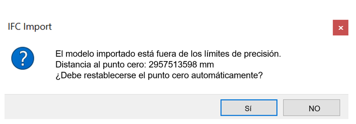
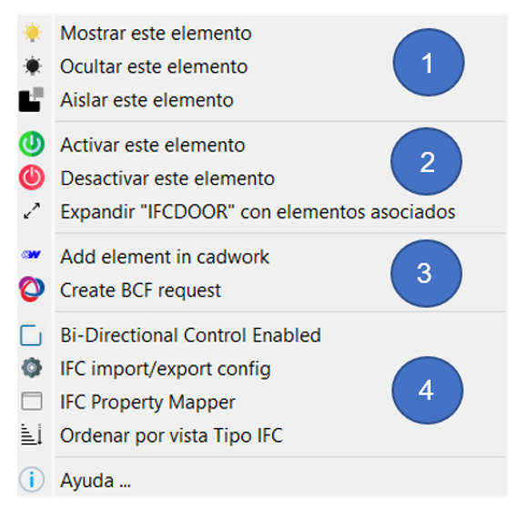
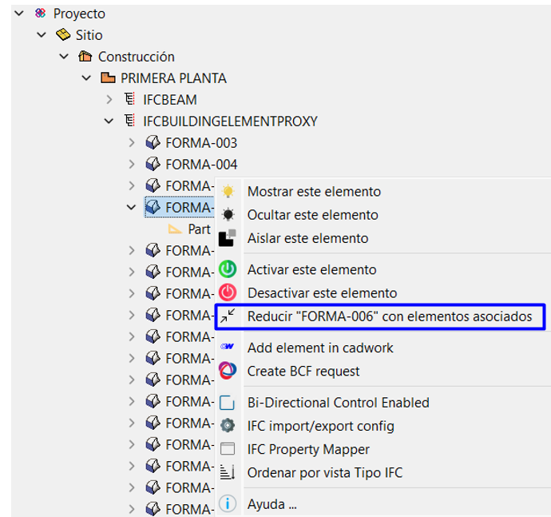
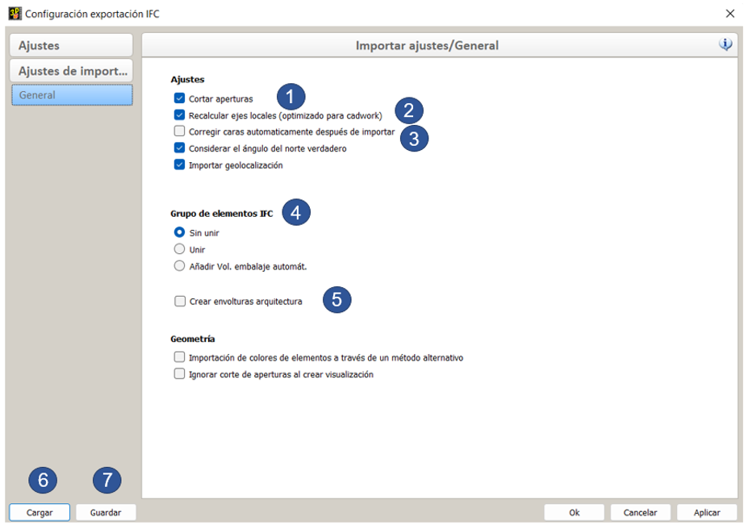

# Importación IFC

El rápido aumento del desarrollo técnico en las industrias de la construcción conduce a una gran demanda, así como los requisitos de un intercambio de datos digitales de los modelos de construcción. Cadwork ofrece amplias posibilidades en el intercambio de datos con los esquemas IFC y BCF a partir de la versión 27. En este documento, sin embargo, solo se discute la versión 28 (2021).

Cadwork está certificado para el intercambio de datos en el esquema IFC 2x3.

Cuando se trata de datos IFC, el esquema del archivo, la versión del esquema, la definición de la vista del modelo ([model-view-definition])(../index.en.md#modelviewdefintion-mvd) así como el conocimiento sobre la estructura del archivo son cruciales. En las siguientes secciones se explicará el manejo del esquema IFC en Cadwork.

## Importación de vídeo IFC

<figure class="video_container">
  <iframe width="560" height="315" src="https://www.youtube.com/embed/aq0Y8BCePD8" title="YouTube video player" frameborder="0" allow="accelerometer; autoplay; clipboard-write; encrypted-media; gyroscope; picture-in-picture" allowfullscreen></iframe>
</figure>

**Añadir archivos IFC**  
Los archivos IFC se importan a cadwork a través de la herramienta de gestión BIM (BMT).
La BMT (BIM-Management-Tool) es la herramienta central para trabajar según el método BIM. Desde aquí se pueden abrir todos los diálogos asociados y se pueden realizar todos los ajustes. Abra la BMT a través del botón Storey/BMT en el encabezado o a través del menú; Ventana -> Gestor BIM.
Los archivos IFC pueden añadirse mediante el símbolo "+" o con la función "arrastrar y soltar" (múltiples archivos posibles).

{: style="width:900px"}

Los elementos importados se importan como **"Objetos de intercambio"**, los cuales sólo se utilizan para la visualización. No se pueden visualizar en el espacio 2D ni ser exportados a planos. Tampoco pueden editarse ni utilizarse para la comprobación de colisiones. Los objetos Exchange (de intercambio) no deben utilizarse como componentes de referencia. La precisión requerida sólo se consigue después de convertirlos.

### Activar elementos

Se pueden activar los elementos por atributo. Presiona las teclas ++ctrl+"A"++ para activar los objetos de intercambio por:

- IFC-building ++ctrl+"A"+shift+"A"++
- IFC-storey ++ctrl+"A"+shift+"S"++
- IFC-type ++ctrl+"A"+shift+"T"++
- Name ++ctrl+"A"+"N"++
- Material ++ctrl+"A"+"M"++
- Color ++ctrl+"A"+"C"++

Después, los elementos activos pueden convertirse en elementos de cadwork.

## Punto cero global-local

Con el fin de mantener y editar modelos georreferenciados con la precisión requerida por cadwork, el punto cero interno se desplaza al importar archivos IFC georreferenciados. Los elementos demasiado alejados del punto cero pueden provocar problemas de precisión. Después de confirmar el cambio, el vector de desplazamiento se guarda internamente y las coordenadas globales se guardan (Ajustes -> Pto. cero global).

{: style="width:400px"}

Al exportar el contenido requerido del modelo desde cadwork, se tiene en cuenta el vector de desplazamiento y el origen del modelo es colocado en la posición original.

{: style="width:400px"}

 
 

 
 

[IFC coordinate system BibLus](https://biblus.accasoftware.com/de/ifc-coordinate-system-und-georeferenzierung-des-projektss-hrfser-htfw-tkeah5t9weo/){ .md-button .md-button--primary }

## Cambiar la vista jerárquica y estructural

En la segunda pestaña generada tras importar y convertir el ifc, al hacer clic con el botón derecho del ratón en el BMT, se puede escoger que la “vista en árbol” se disponga en función de la jerárquia establecida o del tipo IFC (estructural), ambas visualizaciones se ordenan por tipos.

{: style="width:900px"}

En este menú también se puede abrir el diálogo de configuración de importación IFC..

{: style="width:900px"}

## El menú contextual de BMT

### 1. Visibilidad

- Decide qué elementos se van a mostrar.

### 2. Activar elementos, Vista en árbol (Treeview)

- El estado de activación de los elementos se establece como activo o inactivo.
- La vista en árbol minimizada puede ser maximizada y viceversa.  
  {: style="width:400px"}

### 3. Añadir elemento en cadwork & BCF

- Los elementos de intercambio importados se pueden convertir a elementos cadwork con la opción **Añadir el elemento en Cadwork**. Ahora ya se pueden manejar como elementos constructivos normales en 3D.  

  !!! info " **Consejo!**  Comprueba los elementos de los archivos IFC antes de importarlos a Cadwork en un visor externo (**QualityGate**) y después de la conversión vuelve a hacerlo de nuevo en cadwork para comprobar su exactitud y integridad."

  :bulb: [list of external IFC-viewer](https://bim-me-up.com/die-popularsten-ifc-viewer/){target=\_blank}  

  La conversión puede realizarse a través de **Modificar -> Añadir el elemento en Cadwork** o a través del **menú contextual en BMT**.
  Los elementos válidos se convierten en elementos de cadwork después de realizar la conversión. Los elementos no válidos no se pueden convertir en elementos nativos de cadwork. No válido significa que, por ejemplo, la geometría está descrita incorrectamente.
  Comprueba que los datos son correctos (exactitud, información).

  **Manipulación de geometrías**

  Cadwork ofrece herramientas para la manipulación de geometrías. Hay algunas funciones para la manipulación disponibles en el menú **Modificar -> Opciones...**.
  Por ejemplo, si un modelo se describe sólo a través de superficies (SurfaceModel -> no volume), se puede intentar transformarlas en un volumen (**Modificar -> Opciones... -> Varias superficies en volumen**).

  - Seleccionando **Crear una solicitud BCF** se abre el gestor BCF. Para más detalles consulte el capítulo 4, BCF.

### 4. Importar Ajustes

#### Activación bidireccional

Si la activación bidireccional está activada, el elemento activado en 3d también se resalta en la lista de la vista en árbol.
{: style="width:800px"}

#### Configuración de importación IFC

**Diálogo de configuración**

1. **Cortar abertura**
   - Definición de si la abertura debe ser recortada del contenedor de la pared o si el IfcOpeningElement se va a generar como un panel con abertura de tipo.
     - {: style="width:300px"}
     - {: style="width:300px"}
2. **Recalcular los ejes locales (Optimizado para Cadwork)**
   - Los ejes locales de los elementos se recalculan según los algoritmos típicos de los elementos.
3. **Corregir automáticamente las facetas después de la importación**
   - Las facetas en un plano se recalculan como una sola faceta. Algunas facetas trianguladas pueden reducirse con esta opción.
4. **IfcElementAssembly** (Elemento compuesto)

   - The IfcElementAssembly representa composiciones de elementos como cerchas combinadas, grupos de elementos de acero o entramados generales.
   - 
   - Con los botones se puede elegir entre **eliminar el conjunto estructural (ninguno), agrupar los elementos (Unir) o generar elementos contenedores sobre ellos (Añadir volumen de embalaje automático)**

5. **Crear volumen arquitectónico (envoltura)**

   - Aquí se genera un volumen arquitectónico en bruto (envoltura) de tipo muro, techo o suelo sobre los elementos referenciados
     - Objeto Exchange (intercambio)
       {: style="width:300px"}
     - Elementos convertidos con columen arquitectónico en bruto (Envoltura)
       {: style="width:300px"}

6. **Cargar**

   - Carga la configuración de importación desde el perfil de usuario (Userprofile).

7. **Guardar**
   - Guarda la configuración de importación en el perfil de usuario (Userprofile).

#### Mapeador de propiedades IFC

<figure class="video_container">
<iframe width="560" height="315" src="https://www.youtube.com/embed/DKCo9oiGMUY" title="YouTube video player" frameborder="0" allow="accelerometer; autoplay; clipboard-write; encrypted-media; gyroscope; picture-in-picture" allowfullscreen></iframe>
</figure>

El mapeador de propiedades IFC permite importar cualquier atributo de los elementos IFC a los elementos convertidos en cadwork. El mapeador se abre directamente desde el menú contextual del BMT.

[Property Mapper in detail](../1.Import/property_mapper.es.md)

{: style="width:900px"}

#### Ver por tipo de IFC

[View by IFC-type](../1.Import/import.es.md)
