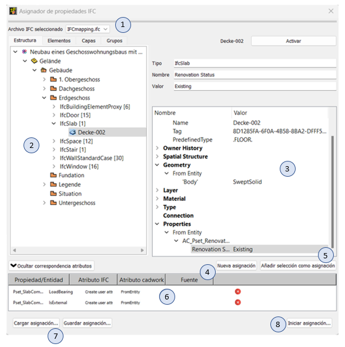

# Asignador de propiedades IFC (Property Mapper)

1. **Archivo IFC seleccionado**
    * Desplegable de archivos IFC cargados en cadwork 3D. Se puede elegir el que se va a configurar, si hay varios importados en 3D.

2. **Vista en árbol del archivo IFC** 
    * El árbol muestra la vista jerárquica del archivo IFC como en BMT. La activación bidireccional también se implementa aquí. 

3. **Barra de herramientas de propiedades**
    * En la barra de herramientas de propiedades se muestra información sobre las entidades (atributos), la pertenencia (estructura), el material y las propiedades.

4. **Nueva asignación**
    * Este botón se puede usar para hacer una entrada manual para l asignación de propiedades desde PropertySet.
    * La entrada de mapeo se aplica a todos los elementos que tienen esta propiedad!
	
5. **Añadir la selección como asignación (recomendado)**
    * Selecciona una propiedad en el árbol de propiedades  (propiedad seleccionada en la imagen --> Renovation Status) y haga clic en "Añadir selección como asignación". Los nombres de las propiedades se transfieren automáticamente a los campos de entrada. Si ahora se activa la casilla "Crear atributo usuario según nombre propiedad" en la ventana emergente de "Añadir nueva entrada", se creará un nuevo atributo de usuario al final de la lista durante la asignación en el caso de que el atributo aún no exista (ver GIF). Este nuevo atributo de usuario recibe automáticamente el nombre de la propiedad. 
    * La asignación se aplica a todos los elementos que tienen esta propiedad!

6. **Vista de lista de las propiedades mapeadas (asignadas)**
    * En la tabla se enumeran las entradas de mapeo existentes.

7. **Cargar/guardar**
    * Se pueden cargar o guardar conjuntos de mapeo específicos del proyecto. Los archivos se guardan en la carpeta del proyecto. 

8. **Iniciar mapeo...**
    * Una vez definidas las entradas de mapeo, se puede iniciar el mapeo adecuadamente. La función se ejecuta sobre todos los elementos del archivo IFC elegido
¡no sólo sobre los activos! 

{: style="width:900px"}

**FromEntity**  
clase, también entidad, clase de elemento, tipo de entidad:  
Según la definición del IFC, una entidad es una clase de información definida por atributos y restricciones comunes. Tanto los atributos como las relaciones con otros tipos de entidades se definen para cada tipo de entidad. Se implementa el concepto de "herencia" orientado a objetos. Esto significa que los atributos y las relaciones se transmiten a los subtipos.

!!! Info
    En general, se debe establecer la opción **FromEntity**. Sólo se debe elegir **FromType** si se debe tener en cuenta explícitamente esta información.  Los tipos de objeto se utilizan en softwares que funcionan con bibliotecas de componentes. Se pueden asignar atributos y propiedades a estos objetos. Los objetos de la biblioteca de componentes sirven como plantilla durante el modelado. Las propiedades del tipo objeto (elemento de catálogo) pueden ser diferentes al tipo de entidad (propiedades modificadas). 
	
	
**FromType**  
Un tipo de objeto, similar a la clase, es también una especie de plantilla que combina características comunes de varios casos. Sin embargo, antes de la solicitud real se definen ciertos parámetros básicos que siguen siendo los mismos para los componentes recurrentes. 
En IFC, el concepto de tipos de objeto se proporciona para poder describir de forma eficiente los componentes que se repiten con frecuencia. Para ello, se predefine un patrón reutilizable, es decir, una especie de "plantilla". Los tipos de objeto pueden definir atributos y propiedades, que se transmiten automáticamente a los objetos vinculados. Esto puede denominarse pre-solicitud. Cuando los tipos de objeto se solicitan realmente, sólo se especifican los datos, como la ubicación o las relaciones con otros objetos. Estos datos no pueden especificarse a través de los tipos de objeto.