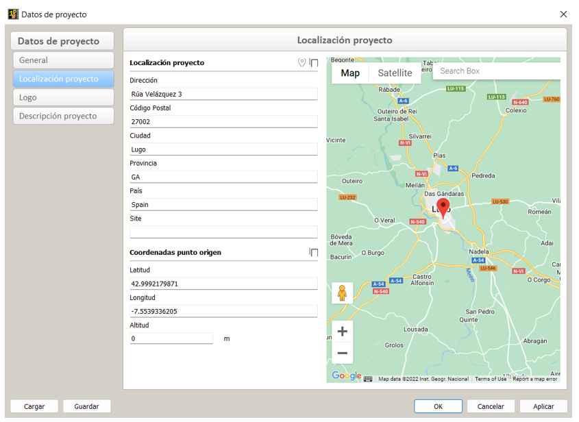

# Modelado

## Configuración del modelo IFC y exportación de cadwork

:bulb:
El equipo proyectista debe definir claramente cómo se van a construir los modelos.

- [x] **Nombre del archivo**
  - Se debe asegurar siempre que la nomenclatura de los modelos dentro de un proyecto sea uniforme y coherente.
- [x] ** Posicionamiento Local**
  - Coordinar la posición local de todos los modelos, cerca del punto de origen.
  - La definición de un origen de coordenadas de proyecto uniforme y la elección de unidades de medida uniformes resulta de enorme importancia para la posterior fusión de los submodelos. El punto de referencia común se define como coordenadas x, y, z y el ángulo hacia la dirección norte (TrueNorth). Todos los integrantes del proyecto deben referirse a este punto de referencia. El punto de referencia debe estar lo más cerca posible del edificio.
- [x] **Disposición y denominación de los niveles de construcción**
  - Nombrar los Storeys y definir la altura correcta de los mismos. Asignar el Storey correcto a cada elemento. Asegurarse de que todos los integrantes utilizan una nomenclatura coherente, ordenada numéricamente con una descripción alfanumérica. Todos los modelos, Storeys, secciones constructivas y contenidos comunes deben seguir una nomenclatura uniforme.
- [x] **Uso correcto de las entidades**
  - Utilizar la entidad (entity) más adecuada para el objeto y compleméntarla con una TypeEnumeration cuando sea posible. Ejemplos: Muro = ifcWall, Viga = ifcBeam, Pilar = ifcColumn, Escalera = ifcStair, Puerta = ifcDoor etc.
  - En cadwork no se disponen de herramientas orientadas a objetos (ObjectTools), por lo que es necesario asignar un IfcType correcto.
- [x] **Detalle**
  - El nivel de detalle de los elementos del modelo para el intercambio de datos (Exchange data) debe ser definido por los integrantes del proyecto. Se pueden asignar muchas propiedades a los elementos, pero no todas son necesarias en todos los proyectos. Con el fin de evitar un aumento innecesario en la cantidad de datos, así como para obtener una mejor visión general, debe determinarse previamente qué propiedades son realmente necesarias.

## Tipos IFC :bulb:

| Elemento cadwork                 | Aplicación                                                                                                                                                                                                                                                                                                                                                                                                                                                                                                             | Tipo IFC (IFC-type)     |
| -------------------------------- | ---------------------------------------------------------------------------------------------------------------------------------------------------------------------------------------------------------------------------------------------------------------------------------------------------------------------------------------------------------------------------------------------------------------------------------------------------------------------------------------------------------------------- | ----------------------- |
| Beam                             | Elementos de tejado, madera de entramado, tirantes, etc. Un elemento IfcMember es un elemento estructural utilizado para soportar cargas entre o más allá de los puntos de apoyo. No es necesario que soporte cargas. La orientación del elemento (horizontal, vertical u oblicua) no es relevante para su definición (a diferencia de IfcBeam e IfcColumn). (Ejemplo de aplicación: puntal, pilar, viga, tronco)                                                                                                   | IfcMember               |
| Beam                             | Un IfcBeam es un elemento estructural horizontal o casi horizontal que puede ser cargado principalmente por flexión. (Ejemplo de aplicación: viga de apoyo, durmiente).                                                                                                                                                                                                                                                                                                                                             | IfcBeam                 |
| Beam                             | Un ifcColumn es un elemento estructural vertical o casi vertical que transfiere el peso de la estructura por encima de ella a otros elementos estructurales por debajo aplicando presión. No es necesario que soporte la carga.   (Ejemplo de aplicación: soporte vertical)                                                                                                                                                                                                                                         | IfcColumn               |
| Panel                            | Un IfcPlate es una elemento plano y de espesor constante (principalmente). Una losa puede ser un miembro estructural que transporta cargas entre o más allá de los puntos de apoyo, pero no es necesario que soporte carga. La posición de la losa (horizontal, vertical o inclinada) no es relevante para su definición (a diferencia de IfcWall e IfcSlab (como forjado)).   (Ejemplo de aplicación: entablado)                                                                                                   | IfcPlate                |
| Panel                            | Un ifcFooting es la cimentación de una estructura que distribuye y transfiere la carga al suelo. También se denomina cimentación superficial a aquella en la que las cargas se transfieren al suelo cerca de la superficie.   (Ejemplo de aplicación: Zapata, cimientos)                                                                                                                                                                                                                                            | IfcFooting              |
| Panel                            | Un ifcSlab es un componente de la construcción que normalmente encierra una habitación en vertical. El forjado puede ser el soporte inferior (suelo) o la estructura superior (forjado del techo) de cualquier estancia de un edificio. Cabe señalar que solo la parte central o estructural de esta construcción se considera un techo. El acabado superior (suelo, panel de techo) y el acabado inferior (techo, falso techo) se consideran revestimiento.   (Ejemplo de aplicación: techo, falso techo, forjado) | IfcSlab                 |
| Surface, auxiliary volume, panel | Definición de elementos que cubren una parte de otro elemento y que dependen de este otro elemento. (Ejemplo de aplicación: superficie, revestimiento, tratamiento)                                                                                                                                                                                                                                                                                                                                                 | IfcCovering.            |
| Panel                            | Muro cortina, muro no portante que se sitúa en el exterior de un edificio y lo encierra. (Ejemplo de aplicación: muro cortina)                                                                                                                                                                                                                                                                                                                                                                                      | IfcCurtainWall          |
| Wall                             | El muro representa una estructura vertical que puede delimitar o dividir espacios. Los muros suelen ser elementos planos verticales o casi verticales que suelen estar diseñados para soportar cargas estáticas. Un muro no tiene por qué ser portante. (Ejemplo de aplicación: muro).                                                                                                                                                                                                                              | IfcWall                 |
| Room                             | Una habitación representa un área o volumen real o teórico delimitado. Las habitaciones son áreas o volúmenes que proporcionan ciertas funciones dentro de un edificio.                                                                                                                                                                                                                                                                                                                                                | IfcSpace                |
| Opening                          | Un ifcOpeningElement representa aberturas (ventana, puerta). (Ejemplo de aplicaión: abertura)                                                                                                                                                                                                                                                                                                                                                                                                                       | IfcOpeningElement       |
| Axis (Connector axis bolt)       | Un conector mecánico que conecta mecánicamente elementos o partes de la construcción. Una sola instancia de esta clase puede representar uno o más elementos de fijación mecánica reales, por ejemplo, una serie de pernos, tornillos o una serie de clavos. (ejemplo: pernos, fijaciones mecánicas)                                                                                                                                                                                                                | IfcMechanicalFastener   |
| Axis (Connector axis bolt)       | Unión con cola: Junta de fijación en la que se utiliza cola para unir elementos. Soldadura: Soldadura utilizada para unir elementos de construcción. Lechada: Mortero utilizado para unir elementos de construcción. La resistencia de la junta puede tenerse en cuenta en los cálculos. (Ejemplo de aplicación: soldadura, unión con cola, grout).                                                                                                                                                                 | IfcFastener             |
| Variant opening                  | Construcción para cerrar una abertura vertical o casi vertical en una pared o en un tejado a dos aguas que permita la entrada de luz y posiblemente de aire fresco.  (Ejemplo de aplicación: ventana)                                                                                                                                                                                                                                                                                                               | IfcWindow               |
| Variant door                     | Construcción para cerrar una abertura vertical o casi vertical en una pared o en un tejado a dos aguas que permite la entrada de luz y posiblemente de aire fresco  (Ejemplo de aplicación: puerta)                                                                                                                                                                                                                                                                                                                 | IfcDoor                 |
| Staircase                        | Un pasillo vertical que permite a los ocupantes caminar (pisar) desde un nivel de piso a otro nivel de piso en una elevación diferente. Un rellano puede incluirse como panel de piso intermedio. (Ejemplo de aplicación: escaleras)                                                                                                                                                                                                                                                                                | IfcStair                |
| Staircase(beam, panel)           | Los peldaños de la escalera y los largueros se incluyen en este objeto.                                                                                                                                                                                                                                                                                                                                                                                                                                                | IfcStairFlight          |
| Circular MEP                     | El elemento de flujo de distribución IfcFlowSegment define la ocurrencia de un segmento de un sistema de distribución de flujo que es típicamente recto y contiguo y tiene dos conexiones (por ejemplo, una sección de tubería o conducto).                                                                                                                                                                                                                                                                            | IfcFlowSegment          |
| Diverse                          | La barandilla es una estructura de entramado utilizada en las zonas de circulación y en algunos límites de espacio en lugar de los muros o como una adición a las paredes.                                                                                                                                                                                                                                                                                                                                             | IfcRailing              |
| Diverse                          | El tipo BuildingElementProxy se utilizará para intercambiar tipos especiales de elementos de construcción para los que aún no existe una definición semántica en la versión actual de IFC. (Ejemplo de aplicación: elementos de construcción no definidos y no clasificados en el esquema IFC)                                                                                                                                                                                                                      | IfcBuildingElementProxy |

Se pueden seleccionar otros tipos IFC en Modificar -> BIM -> Tipo IFC. 
Los tipos IFC documentados pueden encontrarse en la documentación IFC de building-smart: [IFC-Entities Auflistung](https://standards.buildingsmart.org/IFC/RELEASE/IFC4/ADD2_TC1/HTML/){target=\_blank} :point_left:

Los valores predefinidos de asignación de tipo IFC se pueden establecer en Ajustes del usuario (medio engranaje) -> Madera... -> Atributos; Tipos IFC preseleccionados  
{: style="width:900px"}

## IfcProject - IfcSite

El nombre del IfcProject, así como el IfcSite, deben configurarse en los datos del proyecto. 
Ajustes (menú superior) -> Datos del proyecto -> General -> **Nombre del proyecto** (IfcProject) 
Ajustes (menú superior) -> Datos del proyecto -> Localización del proyecto -> **Descripción del sitio** (IfcSite)

## IfcTypes - Asignación automática

En Ayuda-> Teclas F1-F12 existe una posibilidad de asignación automática de tipos IFC en la pestaña **Modificar -> BIM...-> Asignar automáticamente el tipo de IFC (P2D/3D)**. Para todos los elementos activos a los que no se les haya asignado ningún tipo IFC, la función definirá un tipo IFC adecuado para los mismos. Si el tipo no se puede asignar automáticamente, el elemento de construcción recibe el tipo IFC IfcBuildingElementProxy, con el que se asigna al menos una descripción general.
