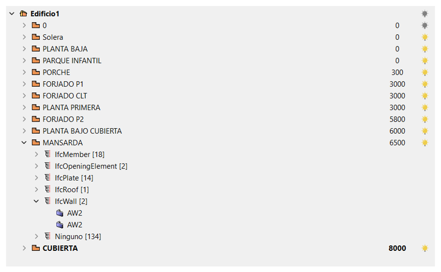
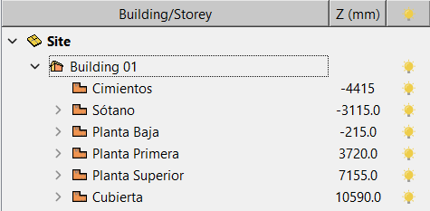
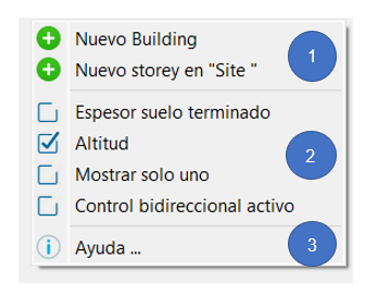
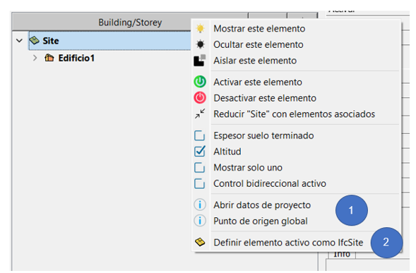

# Gestor de Storey (BMT)

El gestor de Storeys se utiliza para estructurar el proyecto. Se pueden crear edificios y plantas asociadas a estos, en el gestor de planta.
Con la herramienta de gestión BIM (BMT: BIM Management Tool), los edificios y las asociaciones de plantas pueden ser controlados dentro de cadwork. En lugar de la estructura de planta anterior a través del conjunto, el gestor de planta (BMT) se utiliza desde la versión 27.
La herramienta permite una ordenación clara y estructurada de las plantas y los componentes asociados.

## Gestor de Storeys/BIM  

El gestor de plantas o la Herramienta de Gestión BIM (BMT) puede acoplarse al menú de la izquierda o de la derecha o puede abrirse como una ventana adicional.

El administrador de plantas puede abrirse a través de Ventana --> Gestor BIM, o en la barra de configuración superior haciendo clic en el botón "Storey/BMT".

{: style="width:900px"}

## El storey

Un Storey es el conjunto de todas las estancias de un edificio, que se encuentran en un nivel de acceso y están conectadas horizontalmente. Es posible que una planta tenga diferencias de altura. Sin embargo, el factor decisivo es que las habitaciones estén unidas horizontalmente. El término se utiliza hoy en día independientemente del tipo de construcción del edificio. [freely translated according to: German Wikipedia "Geschoss"](<https://de.wikipedia.org/wiki/Geschoss_(Architektur)>)

Muchos softwares de CAD requieren alturas definidas además de la estructura de la planta (Storey). Por lo tanto, las alturas pueden definirse en la configuración del Storey. La altura, conforme a IFC, siempre debe medirse desde el borde superior del suelo sin terminar (como atributo IfcBuildingstorey: Elevation). 
{: style="width:300px"}

Un Storey incluye el suelo y los componentes de "encima" (muros, columnas, etc.).
{: style="width:600px"}

## El menú contextual

Al hacer clic con el botón derecho del ratón en la herramienta de gestión BIM (BMT) se abre el menú contextual.
A través del menú contextual pueden realizarse diversos ajustes. Las opciones del menú contextual difieren para un clic derecho en un edificio y un clic derecho en el área vacía del BMT.

### Clic derecho en el área vacía

{: style="width:400px"}

1. Creación de un nuevo edificio (Building) y creación de una nueva planta (Storey) en el edificio activo.
2. Información mostrada en BMT
   * Espesor del suelo terminado. El grosor del suelo resumido se introduce como un valor.
   * Elevación. Normalmente, la altura de elevación se basa en la parte superior del suelo en bruto
   * Mostrar una planta (Storey). Sólo es visible la planta seleccionada, las demás quedan ocultas.
   * [Control Bi-direccional](../1.Import/import.es.md)
3. Ayuda...  

   * Al seleccionar está opción se redirige a la Guia BIM, donde se explicará la información detallada sobre el sistema de bombillas para su visualización.

### Clic derecho en un edificio (Building) existente / en una planta (Storey) existente

{: style="width:900px"}

1. Configuración Buiding/Storey  
   {: style="width:900px"}
2. Ajustes de visibilidad
   * Tres opciones de filtrado para la visibilidad de la entrada del árbol elegida.
3. Estado de los elementos y maximización/minimización de la vista de árbol
   * Activar o desactivar elementos en la entrada de árbol elegida
   * Los directorios expandidos se pueden minimizar a través de este botón y viceversa

## Asignar elementos Building/Storey

**Opción A**

* Doble clic en el elemento en el BMT se activa el Building/Storey
* Los elementos recién modelados se asignan directamente a este Building/Storey

**Opción B**

* Los elementos activados pueden ser asignados a Buildings/Storeys existentes a través de Modificar -> BIM -> Building o a través de Modificar -> BIM ->Storey