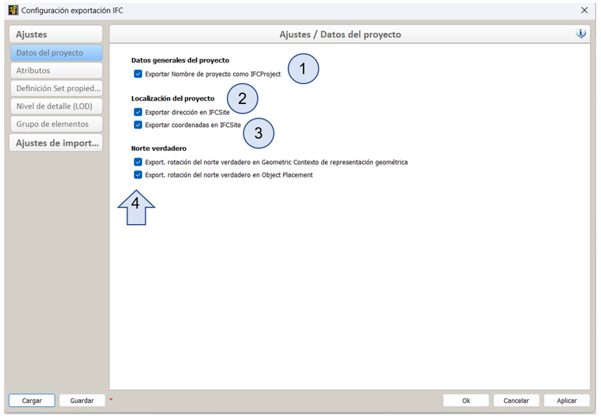
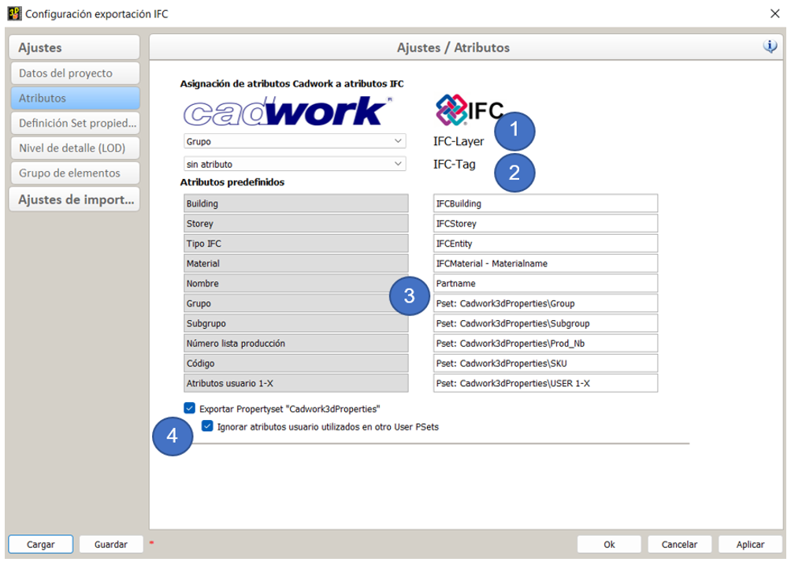
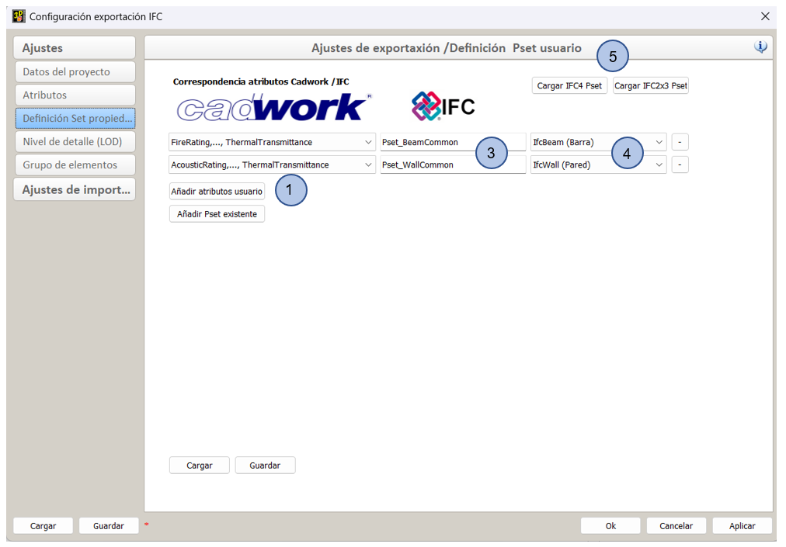
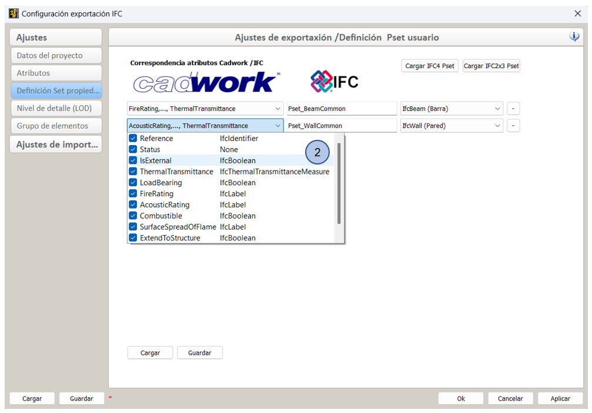
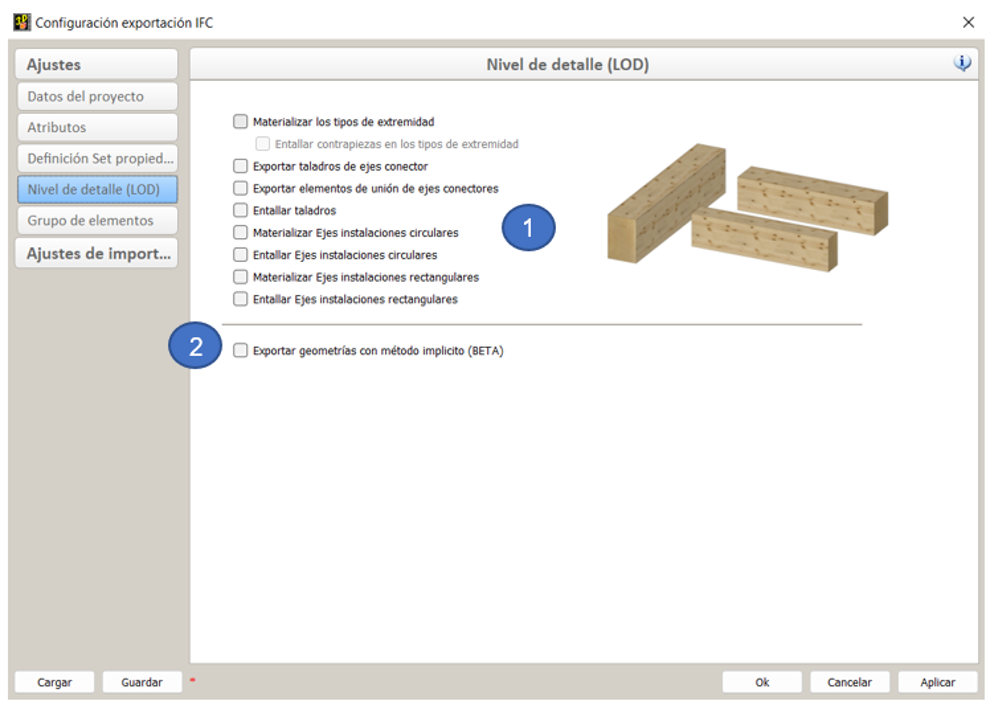
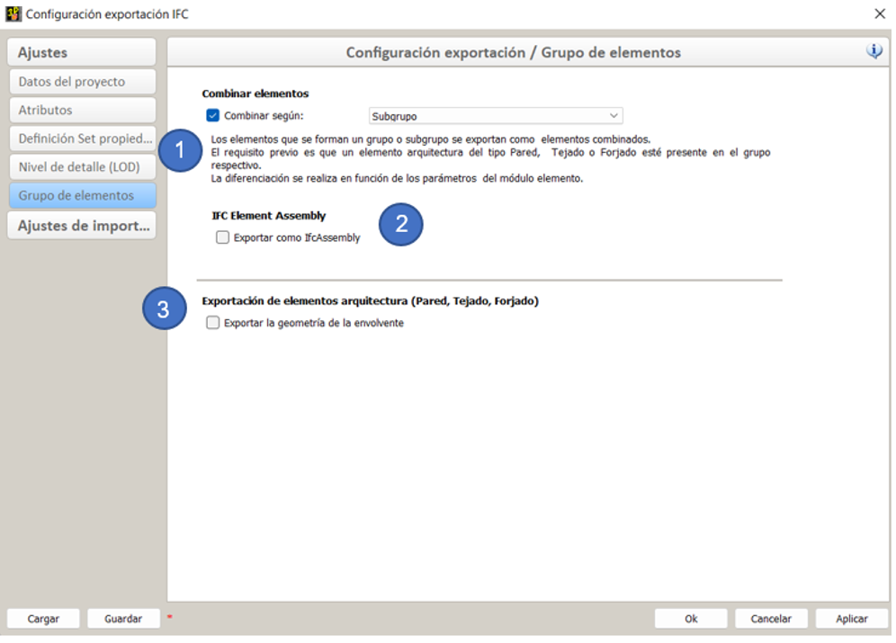

# Exportación de IFC

<figure class="video_container">
  <iframe width="560" height="315" src="https://www.youtube.com/embed/rGLje-72664" title="YouTube video player" frameborder="0" allow="accelerometer; autoplay; clipboard-write; encrypted-media; gyroscope; picture-in-picture" allowfullscreen></iframe>
</figure>

El cuadro de diálogo de configuración de exportación IFC se puede abrir a través de Exportar -> Archivos... -> Engranajes de la opcion Archivo IFC(\*.ifc).

## Datos del proyecto

[Definición del Nombre del proyecto y su ubicación](../2.Modellierung/modelling.es.md)

1. **Datos generales del proyecto**.

   - La casilla de verificación controla si el nombre del proyecto se transfiere a IfcProject.

2. **Ubicación del proyecto:** Los controles de casilla de verificación
   - La casilla de verificación controla si la información sobre la ubicación del proyecto se toma en la exportación IFC.

## Atributos

1. **IFC-Layer** (Capa IFC)
   - Con la IFC-layer se ofrece otra posibilidad para estructurar los datos en diversos programas informáticos. Se recomienda la asignación del atributo Nombre.
2. **IFC-Tag** (Etiqueta IFC)
   - El identificador de etiqueta para la solicitud respectiva de un producto es, por ejemplo, el número de serie o el número de artículo. Se recomienda asignar el número de producción.
3. **Cadwork3dProperties** (Atributos predefinidos)
   - Cadwork escribe por defecto el PropertySet **Cadwork3dProperties**. En este PropertySet se guardan todos los atributos estándar, así como los del usuario.
4. **PropertySet Cadwork3dProperties**
   - La casilla de verificación controla si los atributos de Cadwork deben exportarse en PropertySet Cadwork3dProperties.
   - La casilla de verificación se utiliza si se han realizado más definiciones de Pset. Esta opción evita que los atributos se exporten dos veces.

## Definiciones del Pset

Para el **"Usuario avanzado"** existe la posibilidad de crear sus propios Psets. Estos pueden ser Psets estándar como, por ejemplo, Pset_BeamCommon, o definidos por el usuario como, p.ej: "Properties_Lumber_XY".
Para ello, se crean las IfcProperty en los atributos del usuario. Por ejemplo, esta puede ser la propiedad LoadBearing en User10. Las propiedades requeridas para el Pset se combinan en un conjunto en el diálogo de exportación en la pestaña "Definiciones de Pset".

1. **Creación de conjuntos de propiedades definidos por el usuario**
   - Elija "Añadir atributo de usuario" para comenzar a definir property sets.
2. **Tipos de datos**

   - Después de seleccionar el botón Añadir atributo de usuario, primero seleccionar los atributos de cadwork que se quiere incorporar para el pset de la opción Lista de menú.

     | IfcDataType | Definición                                             | Valor                    |
     | ----------- | ------------------------------------------------------ | ------------------------ |
     | IfcInteger  | números enteros en rango positivo y negativo - INTEGER | 1,100,20                 |
     | IfcReal     | Cualquier número de punto flotante positivo - REAL     | 0.1245, 1.458            |
     | IfcBoolean  | Dos estados 0 & 1 - BOOLEAN                            | True/False, "1" oder "0" |
     | IfcLabel    | Cualquier texto - STRING                               | Holz, Hersteller         |

   - Para los atributos seleccionados, el tipo de datos puede definirse haciendo clic con el botón derecho en el tipo de datos (por ejemplo, IfcLabel) (obligatorio para los psets estándar). En el esquema IFC, el tipo de datos se define para cada propiedad. Para que los conjuntos de propiedades se exporten correctamente, el tipo de datos debe definirse en el diálogo de exportación (haciendo clic con el botón derecho del ratón en la propiedad). 

     

3. **Property set - Nombre**

   - En el campo de entrada de la columna central se define el nombre del conjunto de propiedades. El **prefijo Pset\_** sólo debe utilizarse para los PropertySets estándar del IfcSchema.
   - Si desea eliminar un conjunto de propiedades definidas por el usuario, haga clic en el "símbolo menos" al final de la línea.

4. **Asignación de Property Sets (Conjunto de Propiedades) definidas por el usuario a IfcTypes**

   - En la última lista del menú de opciones, debe seleccionar los tipos de IFC para los que se debe generar este Pset. Por lo que es posible crear Psets muy diferenciados para diferentes partes.

5. **Cargar/Guardar**
   - Después de guardar los conjuntos de propiedades definidos por el usuario, puede volver a cargarlos en cualquier otro proyecto para futuras exportaciones IFC.

## Nivel de detalle

1. **Nivel de detalle**
   - El nivel de detalle del contenido del modelo se puede personalizar según los requisitos.
   - !!! info "**Asegúrese de exportar solo el contenido con los niveles de detalle necesarios para minimizar la cantidad de datos.**"
2. **Método de geometría implícita**
   - Para la opción "Exportar geometría usando el método implícito (BETA)", puede encontrar una explicación más detallada en el capítulo [Geometría](../index.md#geometrie).

## Grupo de elementos

{: style="width:900px"}

1. **Combinar elementos (recomendado)**

   - Si los elementos arquitectónicos con componentes se crean en un archivo 3D (p.ej:[Muro de entramado](../5.Beispiele/examples.es.md)) y cada uno se divide en conjuntos o subgrupos de edificios, los elementos asociados se exportan al archivo IFC resumido con esta opción, como p.ej:IfcWall.

   - Si los elementos arquitectónicos se resumen por conjuntos o subgrupos de edificios, las envolventes (estructura de madera y construcción de bloques) no se generan. Esto se debe a que los componentes individuales combinados representan la pared, el techo o el tejado.
     {: style="width:400px"}

2. **IfcElementAssembly**

   - La entidad IfcElementAssembly representa conjuntos de elementos complejos que se componen de varios elementos. Pueden ser, por ejemplo, elementos compuestos de acero, celosías o escaleras. Cuando se marca la casilla, los elementos no se agrupan como IfcWall, IfcSlab o IfcRoof, sino como IfcElementAssembly.
     En Cadwork, desde hace mucho tiempo utilizamos elementos contenedores para agrupar elementos en un IfcElementAssembly. **Los elementos que se combinan en elementos contenedores se exportan como IfcElementAssembly por defecto en Cadwork.** Esta función no se puede cambiar.

3. **Exportar elementos arquitectónicos**

   - Si la exportación de las capas es necesaria para pasos posteriores, se pueden exportar activando esta opción (no recomendado). Los muros, los techos y los tejados macizos se exportan siempre porque son componentes "reales". No es necesario activar esta opción para los elementos de este tipo.

## Esquemas IFC compatibles

Tanto para la importación como para la exportación, cadwork admite los esquemas IFC 2x3 e IFC4. 

La versión IFC4 combina una serie de mejoras funcionales con una revisión y corrección completas del estándar IFC existente. El objetivo general es mejorar la coherencia del formato IFC, reducir el tamaño del modelo y, al mismo tiempo, proporcionar un conjunto de datos IFC y aplicar las lecciones aprendidas de la aplicación y el uso actuales. IFC4 fue desarrollado como la versión anterior, para la interoperabilidad de los modelos de datos de construcción basados en IFC como estándar para el Open BIM.[^6]

{: style="width:900px"}

[^6]: [ifc2x3 vs ifc4](https://standards.buildingsmart.org/IFC/DEV/IFC4_2/FINAL/HTML/annex/annex-f/ifc2x3-to-ifc4/index.htm)