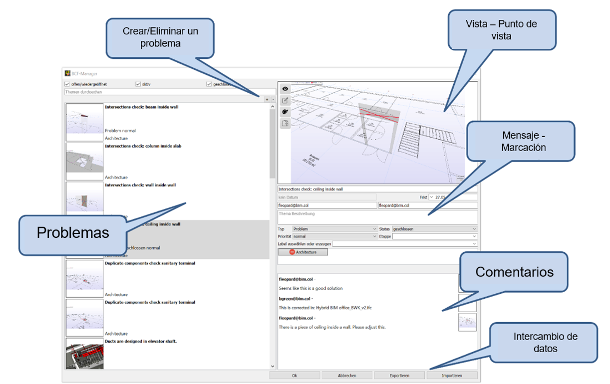

# BCF

## ¿Qué es el formato de colaboración BIM (BCF)?

{: style="width:700px"}

BCF es la abreviatura de BIM Collaboration Format, que es un formato abierto para la comunicación basada en modelos.

En general, el formato de colaboración BIM (BCF) permite que diferentes aplicaciones BIM se comuniquen entre sí de una manera basada en el modelo. Entre diferentes aplicaciones, la versión actual BCF 2.1 permite la transmisión de:

- Anotaciones relacionadas con el modelo (los llamados problemas)
- Los elementos afectados en el modelo (mediante GUIDs de objetos)
- Secciones de pantalla reproducibles.

Esta comunicación basada en el modelo mejora la coordinación. De este modo, se puede intercambiar de forma selectiva información sobre las incidencias en el modelo, su ubicación, la dirección de visualización, el componente, las observaciones, el usuario, la hora o incluso los cambios en el modelo de datos IFC.

El desarrollo de BCF comenzó en 2009 y fue originalmente concebido por dos miembros del grupo internacional de apoyo a la implementación (ISG) de buildingSMART, Solibri y Tekla, junto con el Instituto de Informática Aplicada a la Construcción (iabi) de la Universidad de Ciencias Aplicadas de Múnich, Alemania. Su deseo de utilizar una tecnología de comunicación abierta para los flujos de trabajo basados en IFC llevó a la creación de prototipos y al posterior desarrollo completo de BCF con otros miembros del ISG.

BCF se creó para facilitar la comunicación abierta y mejorar los procesos openBIM basados en IFC mediante el uso de estándares abiertos (formatos de archivo y protocolos de comunicación de datos) para identificar y compartir más fácilmente los problemas basados en modelos entre las herramientas de software BIM, sin pasar por formatos y flujos de trabajo propietarios.

Hay una serie de casos de uso que pueden beneficiarse de los flujos de trabajo BCF dentro o fuera de un proceso BIM. Estos casos pueden ser los siguientes:

- Fase de diseño
  - Documentación de los elementos de garantía de calidad/revisión de la calidad.
  - Identificar los problemas de coordinación del diseño (detección de colisiones, choque) entre las diferentes áreas del proyecto.
  - Comentarios sobre opciones de diseño, sustitución de objetos y selección de materiales
- Fase de adquisición
  - Coordinación de puntos y aclaraciones para licitación.
  - Información sobre costes y proveedores para objetos, conjuntos y/o sistemas.
- Fase de construción
  - Registros de inspección de calidad.
  - Seguimiento de la disponibilidad de objetos/materiales y coordinación de sustituciones.
  - Recogida de información de última hora para la entrega al propietario/operador/constructor, en el marco de los servicios COBie.
- Fase de explotación
  - Anotaciones en los modelos de entrega cuando se realizan cambios en la instalación y sus numerosos elementos durante el uso.
  - Notas del propietario sobre las mejoras necesarias.

BCF es un estándar openBIM de buildingSMART International como IFC y el Diccionario de datos (bSDD), que está abierto a todo el mundo. [^5]

## BCF en Cadwork

<figure class="video_container">
  <iframe width="560" height="315" src="https://www.youtube.com/embed/3uY7HpMijuA" title="YouTube video player" frameborder="0" allow="accelerometer; autoplay; clipboard-write; encrypted-media; gyroscope; picture-in-picture" allowfullscreen></iframe>
</figure>

Abrir el BCF Manager directamente desde el Gestor BMT, o desde Ventana -> BCF Manager. Hacer clic en el botón "+" para crear un nuevo tema.
Se creará una captura de pantalla de la vista actual. Además de la captura de pantalla real, también contiene un Viewpoint (coordenadas de la cámara en el espacio 3D), las visibilidades de los elementos y el estado de los componentes activos.

{: style="width:900px"}

Se puede usar el administrador de BCF también de forma nativa para la colaboración interna de cadwork, por ejemplo, para la documentación de los cambios.

[^5]: [BIMcert](https://technical.buildingsmart.org/standards/bcf/)

