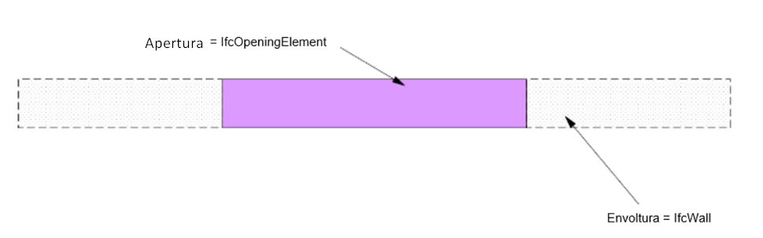
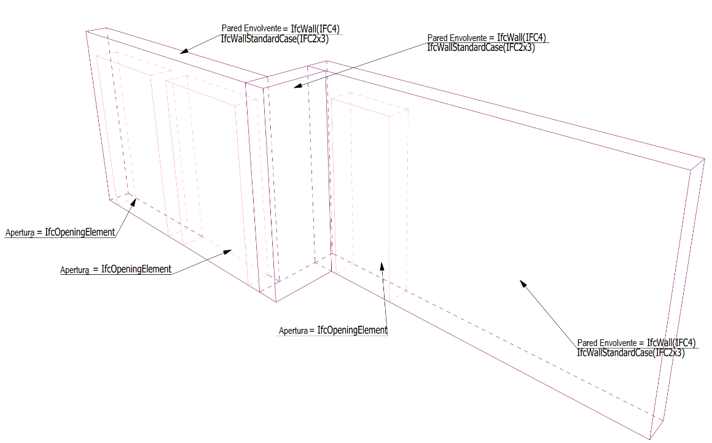
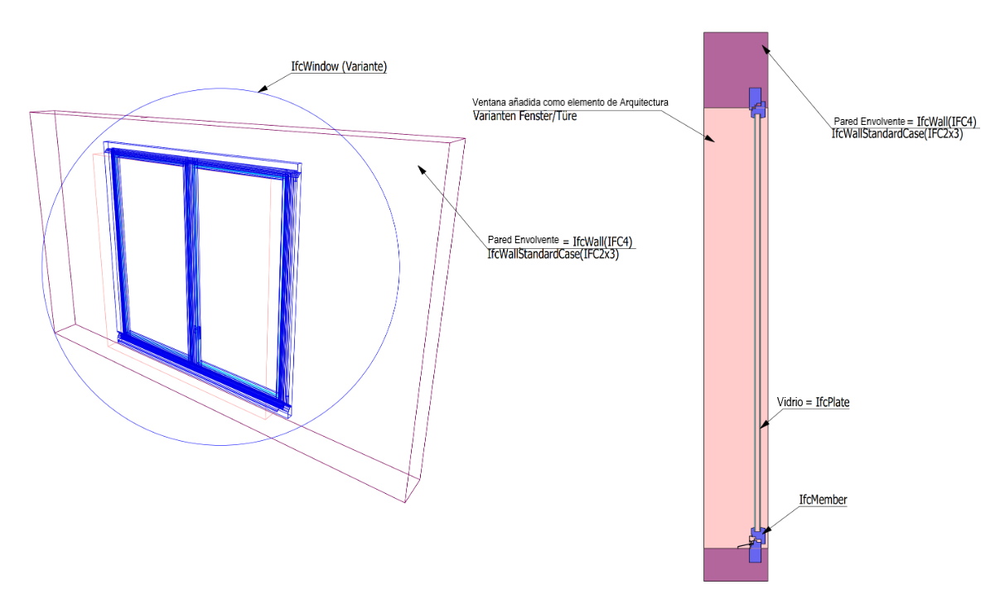
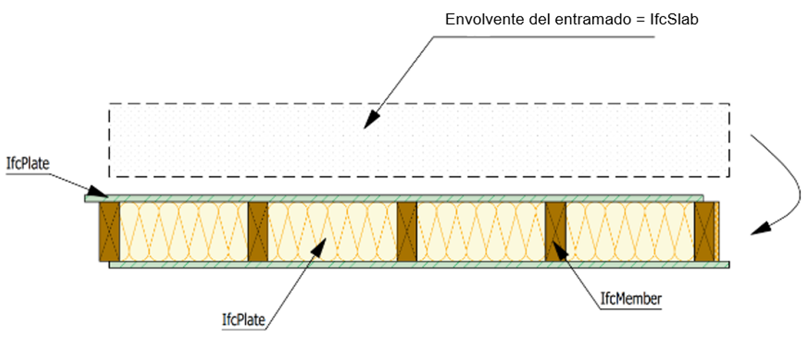
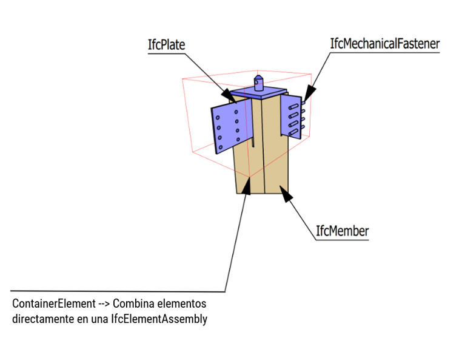
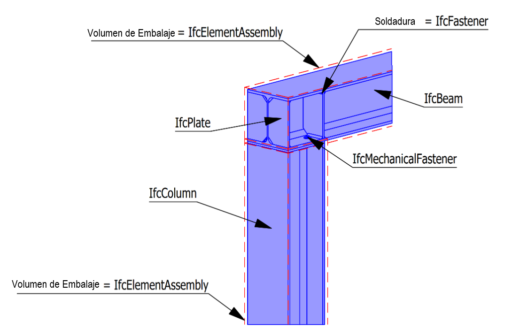

# EJEMPLOS

Aquí se encuentran algunos ejemplos de elementos de cadwork con el tipo IFC correspondiente. Las cubiertas arquitectónicas se han colocado desplazadas de los componentes para una mejor representación. 

## Elementos de cubierta (Arquitectónicos)
Para exportar envolturas, la casilla de verificación debe estar activada en la ventana de configuración de exportación IFC -> Grupo de elementos -> :white_check_mark: Exportar la geometría de la envolvente. Si los elementos de arquitectura se modelan para la extracción de datos, deben necesariamente modelarse con envolturas. Las aberturas en las paredes no se cortan, sino que se modelan con el tipo de elemento Apertura.

### Muros y aperturas

### Puertas y Ventanas
Las ventanas y las puertas están conectadas por los elementos arquitectónicos-> puerta/ventana (variante). Con este procedimiento, estos elementos se exportarán correctamente como IfcWindow o IfcDoor. 

## Forjado de entramado
Los elementos se agrupan como subgrupo o grupo.   
!!! info  Activa la casilla :white_check_mark: Combinar según: en la Configuración de exportación IFC -> Grupo de elementos. Con la casilla de verificación activa, los elementos se combinan para formar el componente (p. ej., IfcSlab). La casilla -> Exportar la geometría de la envolvente deberá estar desactivada :x:."

!!! Tip
    Utiliza el IfcType -> IfcSlab también para los elementos de tejado. En las propiedades del elemento Ctrl+E, se debe elegir el tipo Tejado. Esto dará como resultado el tipo **IfcSlab con PredefinedType ROOF** en IFC-export. 

## Muro de entramado
Los elementos se agrupan como subgrupo o grupo.  

## Conjuntos de elementos y ensamblajes
!!! info "   IfcElementAssembly se utiliza para elementos complejos combinados de varias piezas individuales.  EJEMPLO: Los grupos funcionales de entramados de madera o acero pueden ser representados por la entidad IfcElementAssembly. También se puede utilizar para escaleras u otros elementos prefabricados."

### Partes metálicas

## Escaleras

* IfcStair
    * IfcPlate
    * IfcStairFlight
    * IfcRailing
    * ...

Las escaleras se crean con la herramienta de módulo Escalera. Los elementos pertenecientes a la escalera se combinan automáticamente como IfcStair durante la exportación IFC. Los componentes contenidos en la escalera, como losa, zanca, barandilla, etc., deben tener asignado el IfcType adecuado. 

