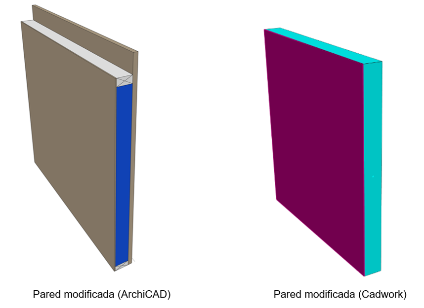
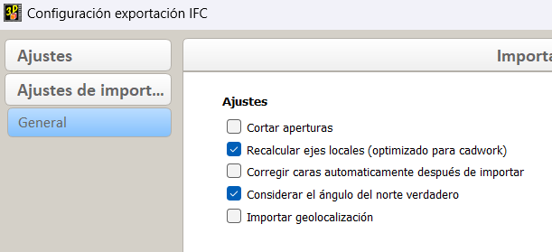
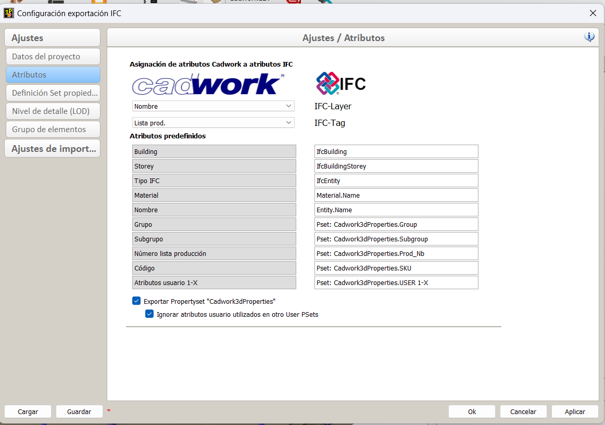
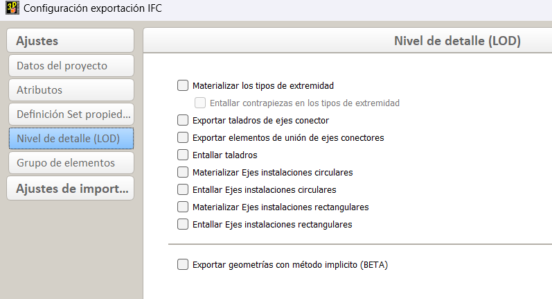
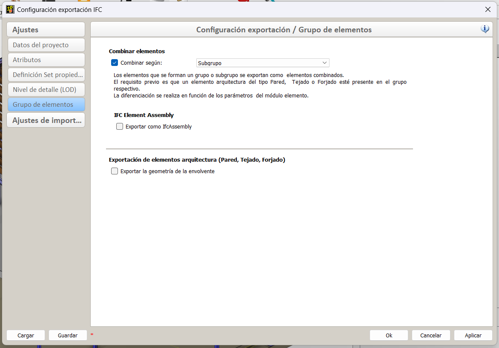

# Flujo de trabajo ArchiCAD 24

## open BIM Workflow I ArchiCAD 24 – cadwork Holzbau v28

## General

Este manual describe el flujo de trabajo openBIM basado en IFC 2x3 CV2.0 entre ArchiCAD y Cadwork.

<iframe width="560" height="315" src="https://www.youtube.com/embed/bbDkPNFKdl4" title="YouTube video player" frameborder="0" allow="accelerometer; autoplay; clipboard-write; encrypted-media; gyroscope; picture-in-picture" allowfullscreen></iframe>

## Exportación IFC ArchiCAD 

Desarrollo de un modelo de construcción en ArchiCAD utilizando las herramientas de modelado comunes. Se debe tener en cuenta que el modelo de edificio se construye planta a planta y utilizar los conceptos básicos del módulo ArchiCAD ACADEMY [Module 1 Introduction](http://www.ac-academy.ch/?id=4357) como una guía al construir el modelo. Además, tenga en cuenta lo siguiente al modelar:

-	No deberá haber intersecciones con cortes de inglete entre las paredes de soporte y las no portantes. Esto es especialmente importante si solo se filtra la estructura de soporte para la exportación de IFC.
-	En la medida de lo posible, las paredes deben construirse en una o varias capas. Los perfiles complejos solo deben utilizarse cuando se requieren detalles especiales en la estructura de la pared.

Se debe tener en cuenta las siguientes características a la hora de crear una plantilla:
-   Estructura de los componentes/perfiles multicapa (Estructura, rastrelado, revestimientos...)
-   Función portante de los elementos (elementos no portantes, elementos portantes)

**Exportación IFC**

Dado que la exportación de IFC es una transferencia de elementos 3D inteligentes, se debe cambiar a la ventana 3D antes de exportar. Aquí, es necesario utilizar filtros para crear un modelo de exportación para el "fabricante/carpintero" a partir del modelo arquitectónico desarrollado
Para ello, se usan las siguientes funciones para mostrar el modelo arquitectónico sin habitaciones, muebles y entonrno como un modelo "shell". El planificador de la construcción de madera solo necesita los elementos filtrados del modelo arquitectónico.

{: style="width:600px"}

**Filtrar y cortar elementos en 3D:** Los elementos que no se necesiten para la estructura de madera deben ocultarse. Elementos como ventanas, puertas, ventanas de buhardilla, elementos de iluminación y, sobre todo, habitaciones no son necesarios.

**Representación estructural:** Seleccionar aquí la opción "sólo núcleo" o como máximo "sólo núcleo de elementos portantes". La elección óptima depende de si ya se ha definido claramente por parte del arquitecto qué elementos son portantes y cuáles no.

**Capas:** Crear una combinación de capas que filtre los elementos que no se han podido eliminar con la función de filtro 3D, de modo que sólo sean visibles los elementos de construcción relevantes.

{: style="width:300px"}

En la configuración del traductor IFC (Archivo/Datos externos/IFC) los ajustes en Conversiones de geometría para la exportación de IFC deben verificarse desde la exportación Cadwork y seleccionar la opción marcada si fuese necesario.

{: style="width:600px"}

Utilice el navegador para crear una sección directamente desde la ventana 3D una vez que los filtros se hayan configurado correctamente. Ahora puede usar Archivo/Guardar como... Guarde la plantilla como archivo IFC. En Exportar seleccionar "Elementos visibles en todas las plantas" para que los filtros definidos previamente se apliquen para la exportación y en el traductor seleccione "cadwork".
**Tip** :bulb: : Puede vincular la sección de la ventana 3D a través del organizador a un conjunto de editores para la exportación de IFC para guardar el traductor para la exportación de IFC además de los filtros.

**Comprobación del archivo IFC (Quality Gate)**
Antes de compartir su plantilla, debe examinar su contenido. Para una inspección visual sencilla, puede utilizar diferentes visores IFC, que puede descargar gratuitamente (por ejemplo, FZK Viewer, BIM Visión, Solibri, etc.).

## Importación IFC en Cadwork

Este tutorial describe los ajustes para una óptima importación de modelos IFC en cadwork, que fueron exportados desde ArchiCAD.

**Comprobación de entrada del archivo IFC (Quality gate)**

El archivo se abre en un visor IFC y se comprueba el contenido definido para el intercambio de datos (designaciones, punto cero, rotación, clasificación de componentes, precisión, etc.). 

**Importación IFC**

Importar el archivo IFC a través de BIM Management Tool (BMT) en cadwork. La jerarquía IFC (estructura de clases, asignación) se adopta en el BMT después de la importación. Las plantas o elementos individuales pueden activarse y mostrarse u ocultarse.

Los elementos se importan como objetos de muestra, que se utilizan para la visualización. Mostrar objetos no se puede utilizar para el control de colisiones o para el plan de trabajo.  
Los elementos IFC se pueden utilizar para la alineación visual con la construcción. También es posible tomar puntos, por ejemplo, para realizar mediciones. 
En la Info, Quickinfo y en el menú "Modificar" se muestra la información más importante del elemento. 

Para poder editar los elementos IFC o utilizarlos para las funciones de cadwork, primero hay que convertirlos en elementos de cadwork. Esto se hace en el menú "Modificar" con la función "Añadir elemento en cadwork", o en el menú contextual dentro de la herramienta de gestión BIM. Una vez que las piezas se hayan convertido en elementos cadwork, aparecerán en gris en la pestaña IFC y se mostrarán en la pestaña cadwork-3D en la estructura IFC correspondiente. 

{: style="width:300px"}

Los componentes como la pared, el techo, la abertura o el tejado se reconocen directamente con el tipo de elemento correcto (pared, techo, abertura, tejado) tras la conversión en cadwork. 
Para seguir trabajando con los componentes, hay que comprobar las situaciones de esquina, así como las dimensiones geométricas.

{: style="width:600px"}

	 
Los componentes de perfil de ArchiCAD se importan en capas y no como un volumen "uniforme". Para poder utilizar estos muros como envolvente de un elemento, por ejemplo, es necesario soldar las capas individuales del componente. Con la función "Borrar edición <Ctrl + D>" las ediciones existentes se deshacen después. 

{: style="width:600px"}

**Aperturas**

En la configuración de IFC se puede definir si las aperturas deben ser recortadas en los elementos o generadas automáticamente «Openings».

**Tip** :bulb: : Para generar automáticamente las aberturas durante la importación, se debe deshabilitar la función «Cortar aperturas». 

{: style="width:500px"}

Es obligatorio definir la composición de las aperturas en los requisitos de intercambio del proyecto. 
Sección vertical «Apertura»

{: style="width:300px"}
	

El elemento de apertura consta de tres volúmenes. Se aconseja seguir trabajando con el elemento que se muestra como activo aquí.

**Importante**: Es importante verificar la dimensión d ela saperturas!

{: style="width:600px"}	 

## Exportación IFC en Cadwork

Estas instrucciones describen la configuración de la exportación de los modelos IFC que se van a leer en ArchiCAD. Para que el intercambio de datos con el esquema IFC sea exitoso, es necesario crear antes las definiciones de intercambio. Exportación IFC:

-	Todos los elementos se asignan a la planta correcta.
-	Todos los elementos tienen un nombre único.
-	**Tip** :bulb: : Asigna el atributo "Nombre" a la capa IFC. Esto permite a la arquitectura "filtrar" de forma óptima las posibilidades para los componentes.

    {: style="width:600px"}
 
  

-	Storey (planta) correcta 
-	Alturas de Storey (planta) correctas
-	Definición en cadwork del tipo IFC
-	Posición local de los edificios debe estar coordinada
-	**Tip** :bulb: : Utilizar un elemento existente como origen del archivo (por ejemplo, una pirámide)

{: style="width:600px"}

Solamente se exportan los elementos definidos en los requisitos de intercambio. El nivel de detalle se puede controlar a través de la configuración de exportación. 

**Tip** :bulb: : Intercambio de datos - **tanto como sea necesario pero lo menos posible.**

{: style="width:600px"} 

**Exportar componentes compuestos**

Se recomienda la siguiente configuración para el contorno correcto de los componentes compuestos (construcción de elementos) en el esquema IFC. 

-   Las cubiertas arquitectónicas son visibles para la exportación. Se exporta la información de la envolvente, (obligatorio para la correcta jerarquía IFC).
-	Las cubiertas contienen la entidad IFC correcta (muro, abertura, forjado, tejado, ...).

 
{: style="width:600px"} 

**Control de archivo IFC (quality gate)**

Antes de compartir el modelo, se debe verificar su contenido. Para una comprobación visual, utilizar uno de los diversos visores IFC que se pueden descargar de forma gratuita (p. ej: Solibri Anywhere, FZK Viewer, etc.).

## IFC-import ArchiCAD

**Importación IFC**

ArchiCAD ofrece diferentes métodos para importar modelos IFC. Para actualizar los cambios del proyecto lo más fácilmente posible, se recomienda el método a través de Hotlink/Module. Para hacer esto, selecciona Archivo -> Hotlinks/Módulo -> Colocar Hotlink... Los ajustes están resaltados en la captura de pantalla para una importación óptima.

{: style="width:600px"} 

Con este método, el modelo es simplemente referenciado y puede ser actualizado con el clic de un botón. Todas las demás variantes se encuentran en la ayuda rápida "Importación IFC" en la base de datos de soporte de IDC.

Con la anulación gráfica, se puede verificar la correspondencia del modelo de construcción en madera con el modelo arquitectónico en la ventana 3D.

{: style="width:600px"} 

**Integrar construcciones de madera en los planos**

{: style="width:600px"} 

Si recibe un modelo reducido a la estructura en madera, se pueden utilizar los componentes del mismo como elementos complementarios para planos de planta o secciones. Se debe tener en cuenta que existen algunas posibilidades de optimización con respecto a la configuración básica de la herramienta y la configuración del traductor IFC, que se debe verificar o ajustar antes de la importación.

Configuración de importación IFC

Abrir la configuración del traductor IFC en el menú Archivo -> Datos externos -> IFC -> Traductor IFC... y selecciona el traductor cadwork en la pestaña "Traductor" para la importación. Según su configuración básica, se deben optimizar dos opciones:

1. En la conversión de geometría, la opción "Elementos de construcción" debe seleccionarse para los elementos de construcción, ya que con los elementos Morph, a diferencia de los objetos, se crea una representación real del plano de planta.

    {: style="width:400px"} 

2.	En el contexto de la conversión de materiales y superficies, el material de construcción estándar debe ser reemplazado de hormigón a madera. Si es necesario, también se puede generar una asignación detallada de los materiales de construcción para que la representación de las tramas con respecto a los elementos de la construcción de madera se ajusten a sus deseos.

    {: style="width:400px"} 

**Ajustes básicos de la herramienta de morphing**

Para ver sólo los elementos cortados de la construcción de madera en la vista del suelo, se debe comprobar la configuración básica de la herramienta de morphing antes de importar los datos IFC. Elegir la opción “Sólo secciones” en la configuración básica.

{: style="width:400px"} 

**Ejemplo** :bulb: :

Si se desea ver la construcción de madera del ático como vista inferior, se debe importar este piso individualmente como enlace directo y seleccionar primero la configuración básica de la herramienta Morph en los ajustes para la visualización de la planta (Proyectado con vista inferior).

## OpenBIM - workflow-sheets
[OpenBIM Workflow-Sheets](https://openbim.ch/workflow-sheets/){target=_blank} :point_left: