# Cadwork BIM

{: style="width:700px"}

La digitalización en la industria de la construcción está ganando cada vez más impulso. El método de modelado de información de construcción (BIM) sirve como punto de entrada. El proceso transparente con una alta calidad de información de descripción de objetos y formularios de calidad constituyen la base para las innovaciones digitales. Además de los aspectos técnicos, el método exige **un cambio cultural en la industria de la construcción**. BIM conduce a la transparencia en la comunicación y la colaboración. Es previsible que, en pocos años, como con la introducción de CAD en el último milenio, todo el proceso de ejecución a lo largo del ciclo de vida se adapte para que el método BIM asuma un papel central.

**Es una filosofía de trabajo**

### Q-preguntas, las preguntas que deben hacerse :bulb:<br>

¿**Quién** necesita, **cuándo** y **para qué**, **qué** información y **en qué** formato de archivo **de quién**?
¿**Quién** necesita **cuándo**, **qué**, **de quién**, **cómo** y **para qué** información **en qué** formato de archivo?

{: style="width:700px"}

## Conceptos

| Acrónimo | Terminología                     | Significado                                                     |
| -------- | -------------------------------- | --------------------------------------------------------------- |
| BIM      | Building Information Modeling    | Método de trabajo                                               |
| IFC      | Industry Foundation Classes      | Transporte de datos / Esquema                                   |
| BCF      | BIM Collaboration Format         | Coordinación de cambios                                         |
| bsDD     | buildingSmart Data Dictionary    | Alberga clasificaciones y propiedades en una base de datos      |
| IDM      | Information Delivery Manual      | Descripción de procesos                                         |
| MVD      | Model View Defintion             | Traducción de procesos en necesidades técnicas de software      |
| LOG      | Level of Geometry                | Nivel de exigencia geométrica                                   |
| LOI      | Level of Information             | Nivel de exigencia alfanumérica                                 |
| LOIN     | Level of Information Needed      | Información requerida del solicitante                           |
| Pset     | Property Set                     | Contenedor para información de elementos                        |
| BAP      | BIM-Plan de gestión de proyectos | Documento, que define basicx para la colaboración basada en BIM |
| GUID     | Globally Unique Identifier       | Número de identificación único e inalterable de 128 bits        |

Puede encontrar más términos sobre BIM en el glosario de construcción digital Suizo :
[Glossar bdCH](https://bauen-digital.ch/de/produkte/glossar/){target=\_blank} :bulb:

## El proceso BIM

Las ventajas del método BIM deben aprovecharse plenamente no sólo desde el punto de vista técnico, sino también estructural. Por lo tanto, se recomienda el uso del método openBIM en todos los proyectos. En términos de implementación y colaboración, surgen las siguientes ventajas: <br>
independencia del software y libertad de elección en la aplicación de todos los participantes del proyecto; por lo tanto, no hay desventaja competitiva debido a las estipulaciones sobre el uso de la aplicación, el uso a largo plazo de los datos del modelo (sostenibilidad a través de la certificación ISO de IFC e IDM) y autonomía de la información de modelos específicos de software (transparencia).
Las etapas de desarrollo de BIM proporcionan una clasificación clara al respecto.

- `little BIM`: Isla-BIM, solo se utiliza em disciplinas singulares
- `BIG BIM`: Integración BIM en todas las disciplinas
- `closedBIM`: Solución cerrada, uso de una sola familia de software
- `openBIM`: Solución abierta, intercambio de información a través de varios productos habilitados para BIM.

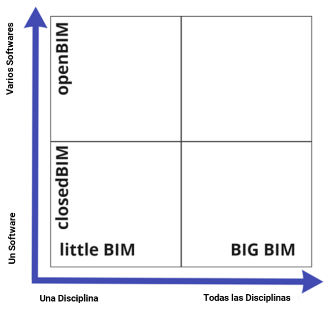{: style="width:700px"}

### openBIM

[^1]OpenBIM amplía las ventajas del BIM (Building Information Modeling) al mejorar la accesibilidad, manejabilidad, gestión y sostenibilidad de los datos digitales en el sector de la construcción. En su esencia, openBIM es un proceso de colaboración neutral con respecto a los proveedores. Los procesos de openBIM pueden definirse como información del proyecto que se puede compartir y que admite la colaboración sin fisuras de todas las partes interesadas en el proyecto. openBIM facilita la interoperabilidad para beneficiar a los proyectos y los activos a lo largo de su ciclo de vida.

OpenBIM permite a los participantes desarrollar nuevas formas de trabajo mediante la transformación de los procesos tradicionales de trabajo. Eliminando discordancias entre datos, openBIM puede mejorar significativamente la entrega de proyectos y el rendimiento de los activos. Las empresas que adoptan un método de trabajo openBIM desarrollan una colaboración entre los distintos participantes, una mejor comunicación y métodos de reparto conformes a las normas del sector. Esto conduce a mejores resultados del proyecto, mayor predictibilidad, mejor desempeño y mayor seguridad con menor riesgo.
A lo largo del ciclo de vida de una instalación, openBIM ayuda a conectar a las personas, los procesos y los datos para alcanzar los objetivos de entrega, operaciones y mantenimiento de la instalación. OpenBIM y flujos de trabajo digitales sin fisuras hacen que la información crítica del proyecto sea accesible a todas las partes interesadas de manera oportuna para apoyar la toma de decisiones en varias etapas del proyecto - desde el diseño hasta la entrega, la rehabilitación e incluso la demolición. OpenBIM elimina el problema tradicional de que los datos BIM normalmente están limitados por formatos de datos de proveedores propietarios, por disciplina o por fase de un proyecto.

Al adherirse a los estándares y flujos de trabajo internacionales, openBIM amplía el alcance y la profundidad del uso de BIM mediante la creación de una dirección y un lenguaje comunes. Las aplicaciones técnicas desarrolladas para openBIM mejoran la gestión de datos y eliminan los flujos de trabajo inconexos. Los parámetros de calidad independientes garantizan un intercambio de datos abierto fiable. OpenBIM permite flujos de trabajo digitales basados en formatos neutros para el proveedor, como IFC, BCF, etc.

OpenBIM permite crear un gemelo digital accesible, que constituye la base central de una estrategia de datos a largo plazo para las instalaciones construidas. Esto garantiza una mayor sostenibilidad de los proyectos y una gestión más eficaz del entorno construido.
[^1]: [buildingsmart](https://www.buildingsmart.org/about/openbim/openbim-definition/)

**Los principios de openBIM**

1. La interoperabilidad es la clave de la transformación digital en el sector de la construcción
2. Deben elaborarse normas abiertas y neutrales para facilitar la interoperabilidad
3. El intercambio fiable de datos depende de medidas de calidad independientes
4. Los flujos de trabajo de colaboración se mejoran con formatos de datos abiertos y ágiles
5. La flexibilidad en las opciones tecnológicas crea más valor para todas las partes interesadas
6. Se garantiza la sostenibilidad mediante normas de datos interoperables a largo plazo

Los beneficios para las industrias de la construcción son:

- [x] openBIM mejora significativamente la colaboración en la entrega de proyectos.
- [x] openBIM permite una mejor gestión de activos.
- [x] openBIM permite el acceso a los datos BIM creados durante el diseño para todo el ciclo de vida de la estructura.
- [x] openBIM amplía el alcance y la profundidad de los entregables BIM mediante la creación de un enfoque y un lenguaje comunes, a través de estándares internacionales y procesos de trabajo definidos en común.
- [x] openBIM permite un entorno de datos común que ofrece a los usuarios oportunidades para desarrollar nuevos flujos de trabajo, aplicaciones de software y automatización de la tecnología.
- [x] openBIM permite crear un gemelo digital accesible, que constituye la base central de una estrategia de datos a largo plazo para las instalaciones construidas.

| openBIM                                                                                                           | Datos                               |
| ----------------------------------------------------------------------------------------------------------------- | ----------------------------------- |
| Los datos OpenBIM deben ser **legibles** para todos, **comentables** para muchos y **modificables** para algunos. | 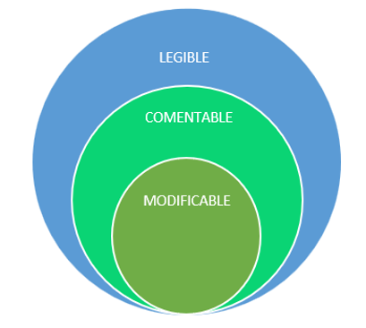 |

### Factores para el éxito del BIM

Solo teniendo en cuenta los siguientes factores puede llevarse a cabo con éxito un proyecto BIM.

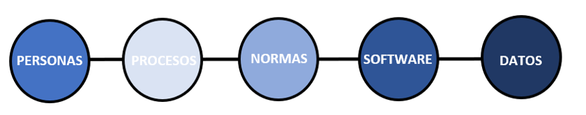{: style="width:700px"}

### Requisitos de información

**Level of Information Need (LOIN)** ó nivel de necesidad de Información y su implementación en los diferentes niveles de detalle (LOG/LOI).

**Level of Geometry (LOG)** ó nivel de geometría, define el contenido geométrico de un modelo. A medida que el proyecto avanza, la precisión geométrica aumenta.

**Level of Information (LOI)** ó nivel de información, describe el nivel de información de contenido (alfanumérico) de un modelo. Para ello, se definen los atributos de los objetos a utilizar.[^2]

[^2]: [bauen-digital-CH](https://bauen-digital.ch/assets/Downloads/de/180222-BdCH-SwissBIM-LOIN-Verstaendigung-web.pdf)

| Nivel de Geometría                      | Nivel de información                |
| --------------------------------------- | ----------------------------------- |
| 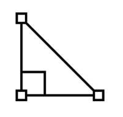 |  |

Las definiciones LOG y LOI deben hacerse de forma individual e independiente. Cabe señalar que la definición de LOD no es la suma de LOG y LOI, por lo que **no puede ser** LOD = LOI + LOG. Las definiciones de LOI y LOG deben definirse independientemente unas de otras, pero específicamente en relación con los objetivos y las aplicaciones correspondientes o con la información requerida para ello por las partes involucradas.

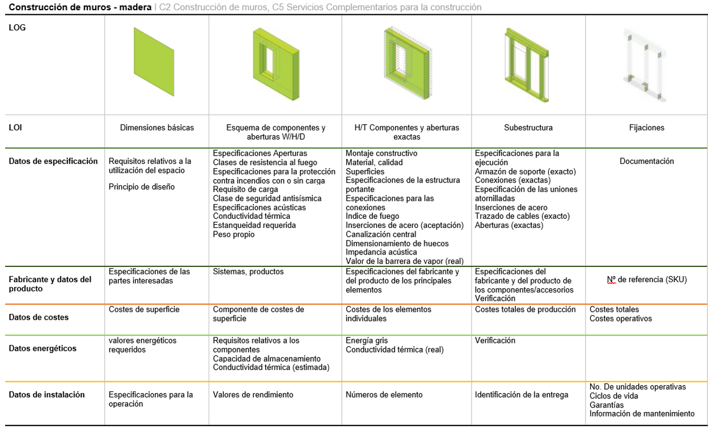{: style="width:800px"}

## Definición de vista modelo (MVD: Model View Defintion)

Extraído del bsI Standards Model View Definition (MVD)[^3] <br>

En general, una MVD, o "Model View Definition", es una selección de entidades de todo el esquema IFC para describir un uso o flujo de trabajo concreto. Los MVDs pueden ser tan extensos como casi todo el esquema (por ejemplo, para archivar un proyecto) o tan específicos como unos pocos tipos de objetos y datos asociados (por ejemplo, para fijar el precio de un sistema de muro cortina).

Para facilitar la interoperabilidad del BIM en cientos de aplicaciones de software, el esquema IFC está diseñado para dar cabida a muchas configuraciones y niveles de detalle diferentes.

Por ejemplo, un muro puede representarse como:

1. Un segmento de línea (o curva) entre dos puntos;
2. Uno de los muchos tipos de geometría 3D para la visualización y el análisis (por ejemplo, como sólidos extruidos o superficies trianguladas);
3. Formas simples o con detalles de construcción específicos (capturando de pernos individuales, accesorios de tubería, cableado, etc.)...
4. Junto con datos como especificaciones técnicas, responsables, calendario e información sobre costes. Pero no todos los expertos en el campo de los procesos de diseño, suministro, fabricación y operación de un proyecto necesitan la misma información.

Un MVD utiliza entidades de IFC para definir un estándar de intercambio para un caso de uso o flujo de trabajo particular. Este estándar de intercambio (MVD) es implementado por los proveedores de software.

[^3]: [MVD-buildingsmart](https://www.buildingsmart.org/standards/bsi-standards/model-view-definitions-mvd/)

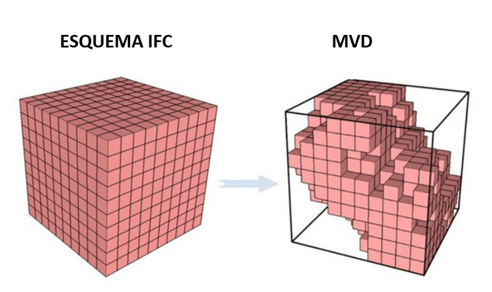{: style="width:700px"}

## Esquema de datos IFC, estructura

Extraído de BIMcert Handbuch 2021[^4] <br>

IFC está integrado en todas las aplicaciones BIM comunes. La certificación de software por buildingSMART internacional garantiza una alta calidad de transmisión.
Todos los elementos funcionales están vinculados a las plantas (Storeys) y, por lo tanto, también están asociados al edificio (Building). Además de la información geométrica y alfanumérica (atributos, parámetros y características), un archivo IFC también contiene relaciones entre objetos.
La especificación de la IFC utiliza tres estructuras: estructura de ubicación, estructura funcional y estructura de materiales.
Los datos de localización definen la estructura espacial de un edificio en IFC. Define los lugares, edificios, plantas, componentes y habitaciones en una planta.
Los edificios se representan dentro de la estructura funcional descomponiéndolos en clases de elementos funcionales individuales: por ejemplo, paredes, techos, postes, puertas o ventanas. Se asigna un identificador único (GUID) a cada elemento.

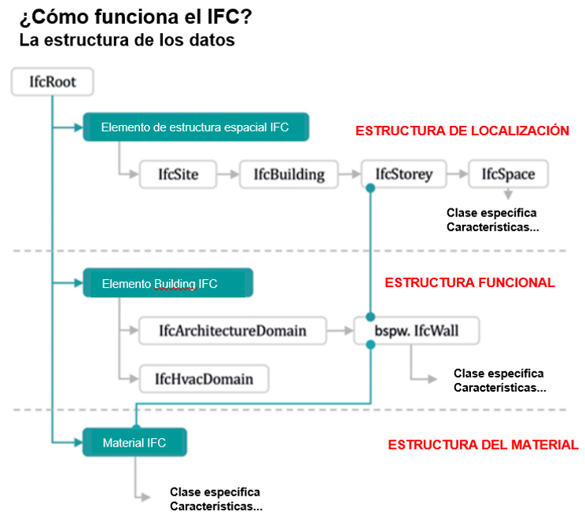{: style="width:700px"}

Cada clase de elemento funcional está optimizada para el mapeo de su dominio funcional. Para ello, lleva un conjunto base estandarizado de características para describir las propiedades relevantes (parámetros), así como su geometría típica (atributos). Las características se organizan en grupos (property sets). Cada clase de elemento lleva un conjunto típico de propiedades (pset) que lleva las características más esenciales. Este conjunto de propiedades se designa con el sufijo "Common", por ejemplo, Pset_WallCommon o Pset_DoorCommon.
Todos los elementos funcionales están vinculados a las plantas y, por tanto, también están asociados a un edificio. Además de la información alfanumérica (atributos, parámetros y características) y geométrica, un archivo IFC también contiene relaciones entre objetos.
Además de la estructura de localización y de la estructura funcional, en la estructura de datos IFC también hay una estructura de material para declarar las propiedades relacionadas con el material.
[^4]: [BIMcert](https://bif.bauwesen.tuwien.ac.at/fortbildung/kurse/aktuelle-kurse/bimcert/)

El formato de archivo alfanumérico está estructurado en dos secciones. La sección HEADER, que contiene la información sobre el archivo, y la sección DATA, que contiene la información sobre el proyecto.

```
ISO-10303-21;
HEADER;
FILE_DESCRIPTION(('ViewDefinition [DesignTransferView_V1.0]','ExchangeRequirement [Architecture]'), '2;1');
FILE_NAME('Export_V2','2021-07-12T14:53:51',(''),('',''),'','cadwork','');
FILE_SCHEMA(('IFC4'));
ENDSEC;
DATA;
#1= IFCPROJECT('1a$RL01_H3_giBD$G0XTyj',#7,'Default Project','Description of default Project',*,*,*,(#15),#11);
#2= IFCPERSON($,'unknown','user',$,$,$,$,$);
#3= IFCORGANIZATION($,'Cadwork Informatik AG','organization',$,$);
#4= IFCPERSONANDORGANIZATION(#2,#3,$);
```

## El modelo

Stachowiak, 1973:

> Los modelos son siempre modelos de algo, para alguien; cumplen su función durante un tiempo y sirven para algo.

Los modelos deben crearse de acuerdo con las reglas definidas en el plan de modelado. [BIM Information Delivery Manual (Basics)] [BIM Informations-Lieferungs-Handbuch (Grundlagen)](https://baustein.xella.ch/media/downloads/BIM-Grundlagen-Informations-Lieferungs-Handbuch-3.pdf)

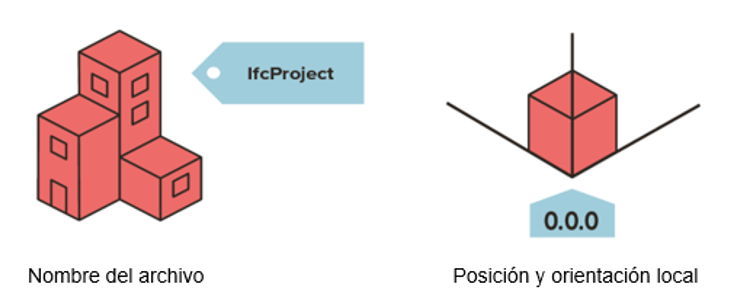{: style="width:700px"}

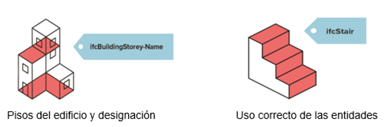{: style="width:700px"}

Cuanto más precisas sean las reglas de modelización [modeling rules]() más fluida será la colaboración basada en modelos. Los problemas de fusión de los modelos pueden sortearse gracias a las reglas definidas y se hace posible una colaboración eficaz.

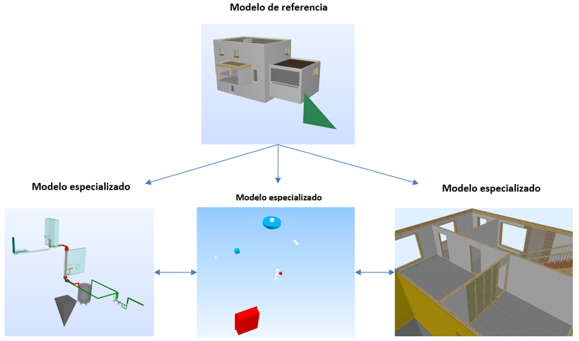{: style="width:700px"}

## Posiconamiento relativo

El modelado geométrico en el modelo de datos IFC está muy orientado al uso de un sistema de coordenadas local.
Por ejemplo, la colocación de una columna no se define globalmente, sino en relación con el sistema de coordenadas de la planta correspondiente.
Las coordenadas de las plantas (IfcBuildingStorey) se modelan a su vez con respecto al sistema de coordenadas del edificio (IfcBuilding). Las coordenadas del edificio se modelan a su vez con respecto al sistema de coordenadas del sitio (IfcSite).

{: style="width:700px"}

## Entidades IFC

Una clase IFC es un **objeto identificado de forma única** en el modelo de datos IFC. Dependiendo de la asignación de clases y de la definición de tipo, el objeto recibe **determinados atributos** y **dependencias** por defecto dentro del esquema IFC.
Por lo tanto, la elección de la clase correcta durante la exportación IFC es muy importante: Si una pared no se asigna a la clase IfcWall, no obtendrá todos los atributos necesarios para ser descrito de forma inequívoca. Entonces tampoco será interpretado correctamente por otros programas para su coordinación o evaluación.

{: style="width:700px"}

## Conjunto de propiedades (Pset: PropertySet)

El IfcPropertySet es un **directorio que contiene propiedades dentro de un "árbol de propiedades"**. Las propiedades se organizan en grupos (llamados Psets = Property Sets). Cada clase de elemento lleva un Pset típico, que lleva las propiedades más esenciales. Este Pset se designa con el sufijo "Common", por ejemplo, Pset*WallCommon o Pset_BeamCommon.
Además, se puede introducir cualquier conjunto de propiedades definido por el usuario. Los conjuntos de propiedades que no se declaren como parte de la especificación de IFC deben tener un valor de nombre que no contenga el prefijo "Pset*".

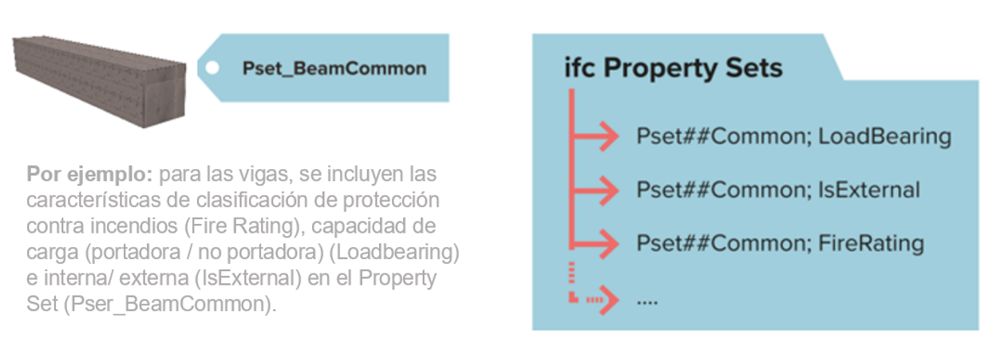{: style="width:700px"}

## Geometría

Teniendo en cuenta la funcionalidad 2.5d, la capacidad de representar objetos tridimensionales con programas CAD existe desde hace más de 30 años. Para poder representar cuerpos tridimensionales y no solo superficies en un espacio, se han añadido las tecnologías de BREP, así como el método CSG.
El formato IFC admite diferentes métodos de representación de la geometría. Según el método de geometría utilizado, se obtienen resultados diferentes.
La calidad y el método de geometría determinan la posibilidad de reutilizar los elementos en Cadwork.

- El modelado explícito con el método B-Rep (Boundary Representation, modelo de superficie límite) es un método geométrico para crear geometrías 3D arbitrarias a partir de superficies de contorno que encierran completamente una geometría envolvente. En el método B-Rep, sólo se guarda el resultado de la creación de un sólido sobre las superficies delimitadoras.
  - el volumen se describe sobre las superficies delimitadoras
  - las formas complejas se describen con un elevado número de facetas
  - representación de superficies no planas -> NURBS (B-splines racionales no uniformes). Este método permite la construcción de superficies de forma libre.

{: style="width:700px"}
{: style="width:700px"}

- El modelado implícito CSG ((Constructive Solid Geoemtry ó Geometría Sólida Constructiva), extrusiones, rotaciones) es un método geométrico para crear geometrías 3D arbitrarias a partir de operaciones entre cuerpos básicos.
  - El volumen se describe mediante una secuencia de pasos de construcción. Los pasos de modelado hasta el resultado se almacenan (historial).
  - Se realizan operaciones booleanas al convertir elementos a cadwork. La geometría resultante se puede utilizar para la producción, por ejemplo, si coinciden factores como la precisión.
  - CSG

{: style="width:700px"}
{: style="width:700px"}

- Extrusión
  - El área se extruye a lo largo de un vector de dirección.

{: style="width:700px"}
